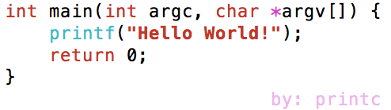

# printc
Print text with color on command console. (Only support UNIX-like platform)

Swift and C++ are both Supported.

# Usage

1. Prints a single text by static function: `printc.print(text:marks:)` or `printc.println(text:marks:)` in Swift.

```swift
printc.print(text: "Once upon a time....", marks: .white, .Purple)
printc.println(text: "Once upon a time", marks: .black, .Red)
```
 Or `printc::print<marks...>(text)` or `printc::println<marks...>(text)` in C++.

```c++
printc::print<Purple, white>("Once upon a time....");
printc::println<Red, black>("Once upon a time");
```

2. Assemble texts and print them before printc object destroying.
```swift
printc.write("int ", .red).write("main(").write("int", .red).write(" argc, ").write("char ", .red).write("*", .purple)
.writeln("argv[]) {").write("    printf", .navy).write("(").write("\"Hello World!\"", .bold, .red).writeln(");").write("    return ", .red)
.write("0;\n}\n").writeln("\t\t\tby: printc", .obscure, .purple)
```
Or `printcolor::printc().write<marks...>(text)` in C++.

```c++
printc().write<red>("int").write(" main(").write<red>("int").write(" argc, ").write<red>("char ").write<purple>("*")
.writeln("argv[]) {").write<navy>("    printf").write<bold, red>("\"Hello World!\"").writeln(");")
.write<red>("    return ").write("0;\n}\n").writeln<obscure, purple>("\t\t\tby: printc");
```


Looks like:



# LICENSE

The MIT LICENSE.
